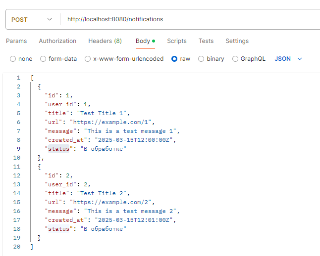
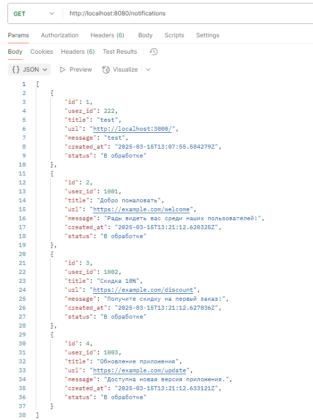

# Backend WB CRM для сервиса нотификации

Backend WB CRM — это серверная часть CRM-системы для управления уведомлениями. Проект предоставляет API для создания, отправки по User ID или CSV-файл уведомлений, а также просмотр их состояний.

## Основные функции

- **Создание уведомлений**:
    - Добавление заголовка, ссылки и сообщения.
    - Возможность отправки уведомлений по User ID или массива User ID через CSV-файл.
- **Получение уведомлений**:
    - Просмотр всех уведомлений в системе.
- **Автоматическое создание таблицы**:
    - При запуске сервиса автоматически создаётся таблица `notifications`, если она ещё не существует.

## Технологии

- **Backend**:
    - Go (Golang)
    - PostgreSQL (база данных)
- **API**:
    - RESTful API
- **Дополнительные библиотеки**:
    - `github.com/lib/pq` (драйвер для PostgreSQL)
    - `net/http` (обработка HTTP-запросов)

## Установка и запуск

### 1. Клонируйте репозиторий

```bash
git clone https://github.com/mrSvin/Go_back_Wb_CrmNotifications.git
cd Go_back_Wb_CrmNotifications
```

### 2. **Запустите проект с контейнером БД PostgreSQL и текущего Go приложения с помощью команды (наличие установленного Docker обязательно)**:   
```bash
docker-compose up -d   
```  

## API Endpoints

#### 1. *Отправка уведомлений*:   


#### 1. *Получение списка всех уведомлений*:   


## Планируемое дальнейшее внедрение функционала
#### 1. Внедрение планировщика для выполнения уведомлений, который будет периодически опрашивать базу данных на предмет уведомлений со статусом "В обработке". После этого он будет поочередно отправлять их на выполнение во внешний API и, в случае успешной отправки, обновлять их статус на "Выполнено".
#### 2. Добавление различных фильтров и пагинации к API для получения списка уведомлений.
#### 3. Внедрение JWT-авторизации для пользователей с различными ролями, что обеспечит верификацию API.